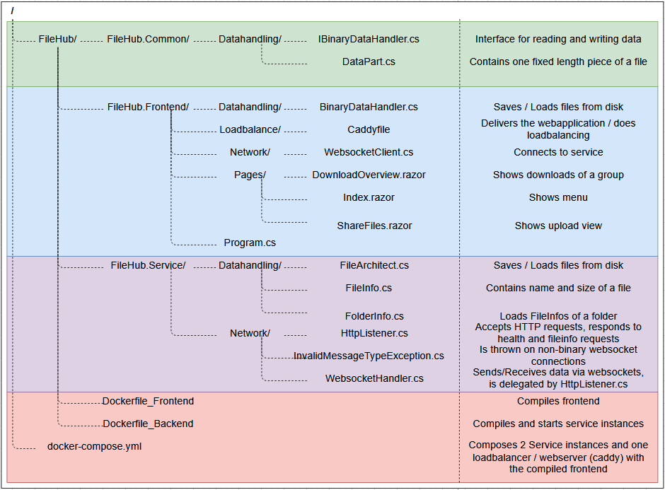
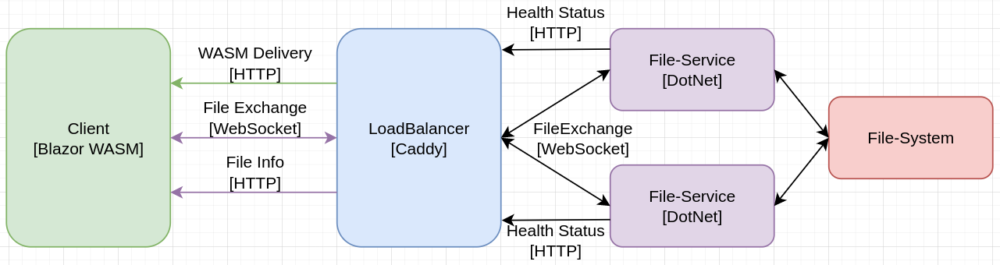
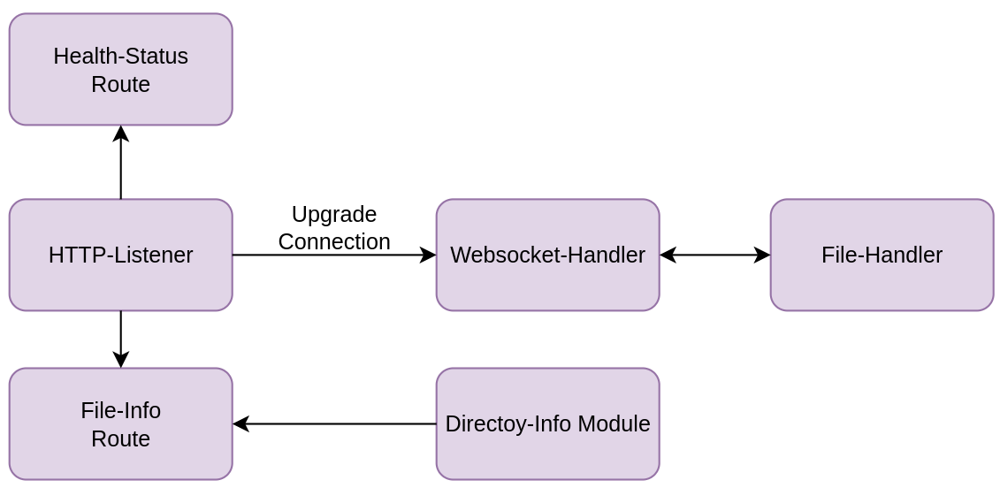
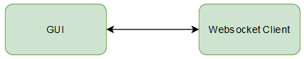
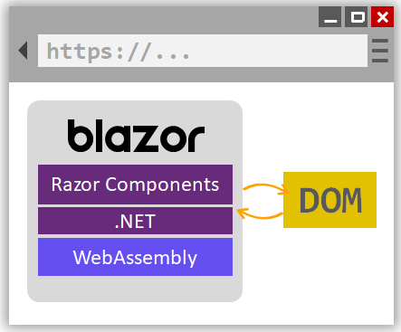
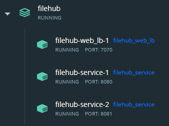

# FileHub
A fault tolerant, load balanced file sharing service.

# Contribution information
- Contributors: Adrian Locher & Jason Benz
- School: [OST - Eastern Switzerland University of Applied Sciences](https://www.ost.ch/)
- Module: Distributed Systems (DSy)
- Semester: Spring 2022
- Advisor: Dr. Thomas Bocek

# Overview
The goal of the project is to create a first own distributed system. Since this is a school project, it is only a software draft with limited functionality. For a productive operation, further development and extensive testing would be necessary.\
Required components ([detailed requirements](https://dsl.i.ost.ch/lect/fs22/#challenge-task-fs-2022)):
- Simple Frontend
- Self implemented websocket
- Scalable and fault tolerance service
- Load balancer
- Dockerization

# Use cases
- File upload
  - A user can upload files which are stored in one folder.
  - A user gets a transfer code for his file folder that he can share with other users.
- File download
  - If a user enters a valid transfer code he gets access to the file folder.
  - A user can download the files from the file folder.

# Technical overview
- Software platform: .NET
- Language: C#
- Frontend: [Blazor WebAssembly](https://dotnet.microsoft.com/en-us/apps/aspnet/web-apps/blazor)
- Websocket: System.Net.WebSockets
- Service: Console Application
- Loadbalancing: [Caddy](https://caddyserver.com/docs/)
- Persistent storage: File system
- Container solution: [Docker](https://www.docker.com/)

# Project Setup  
  
- Please note that this diagram does not display every single file and folder of our project, but all the files and folders necessary how the FileHub system works.

# Architecture  
## System  
  
### Technology-Decisions:
As a frontend technology, we wanted to use a webclient for portability reasons. We chose to use Blazor WebAssembly, because we were already familiar with this technology.  
In between the frontend and the backend, we used Caddy as a loadbalancer and as a webserver to deliver our frontend. Caddy seemed like the right way to go, since it was easy to setup and provided automated switching to only running services, if one service would crash.  
The backend is implemented in .NET for simplicitys sake, since our Blazor frontend is also implemented in .NET. Different libraries were used to create the HTTP and websocket endpoints.  
We use a standard filesystem as our storage-backend and mount it into all our service-instances via Docker. Since we want users to be able to transfer and store big files this made much more sense than serializing the files into a database.  

## Backend  
 
Our backend is basically a HTTP-Webserver with multiple endpoints.  
- Health-Status: Responds always with HTTP-200, to notify the loadbalancer that the service is running.  
- File-Info: Responds information about all files of a group (a group of files is stored inside a single directory named after the group)  
- Websocket Handler: Upgrades the HTTP-Connection to a websocket connection to send and receive files in binary format.  

The File-Handler component reads and writes files from a common storage backend.  
The Directory-Info module gives information about filenames and -sizes of all files in a directory.  

## Client
  
  
DotNet Blazor WebAssembly is based on a DotNet Runtime implemented in WebAssembly.
The GUI parts of the application are translated into HTML5, while business logic implemented in C# runs on the runtime and therefore indirectly on WebAssembly.

## Load Balancing  
Caddy is an easy to configure, free and open source load balancer. We have chosen it because of its simplicity. The load balancer is delivered directly with the frontend and listens on port 7070. To allow the load balancer to handle the service requests, all requests are made over this port. Caddy randomly selects a service instance (port 8080). Every second the health URI (dataservice) is checked. Since the load balancer does not automatically forward the requests in the event of an error, the requests are repeated on the client side. The new request is then routed to a running instance by Caddy.

## Container solution
We chose Docker as our container solution, as this was covered in detail in the lecture and is a prerequisite. With the help of Docker, we create two images.\
One contains the frontend and the load balancer. It listens on port 7070.\
The other one contains the service (backend). This image is currently scaled to 2 containers. Internally, ports 8080-8081 are used, which are exposed to external port 8080. The data is mounted on a shared volume.\

