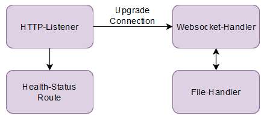

# FileHub
A fault tolerant, load balanced file sharing service.
* Contributors: Adrian Locher & Jason Benz
* School: [OST - Eastern Switzerland University of Applied Sciences](https://www.ost.ch/)
* Module: Distributed Systems (DSy)
* Semester: Spring 2022
* Advisor: Dr. Thomas Bocek

# Use cases
* File upload
    * A user can upload files which are stored in one folder.
    * A user gets a transfer code for his file folder that he can share with other users.
* File download
    * If a user enters a valid transfer code he gets access to the file folder.
    * A user can download the files from the file folder.

# Technical overview
* Software platform: .NET
* Language: C#
* Frontend: Blazor webassembly
* Web socket: System.Net.WebSockets
* Service: Console Application
* Loadbalancing: Caddy
* Persistent storage: File system
* Container solution: Docker

# Architecture  
## System  
  

## File-Service  
  

## Client

## Load Balancing  
